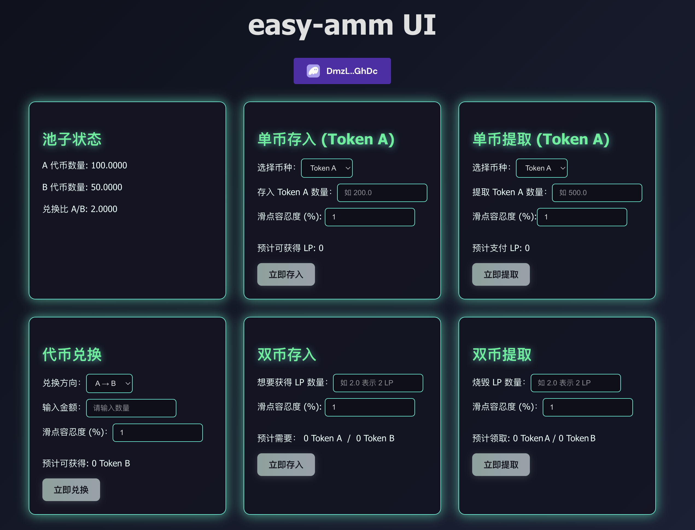

# easy-amm

## 项目简介

**easy-amm** 是一个基于 Solana 区块链的自动做市商（Automated Market Maker, AMM）协议项目。该项目通过 Rust 和 Anchor 框架实现了一个简化的去中心化交易所核心模型，采用恒定乘积公式 (x \* y = k) 进行代币定价，功能上支持创建流动性池、添加/移除流动性以及代币交换等操作。项目包含完整的前后端实现：链上合约提供 AMM 核心逻辑，链下有 TypeScript + React 构建的前端 DApp 与之交互，实现交易界面的展示和操作。**easy-amm** 已部署到 Solana Devnet，任何人都可以使用兼容钱包（如 Phantom）连接前端进行交互测试。

## 功能特性

* **流动性池创建**
* **恒定乘积做市算法**
* **添加/移除流动性（双币/单币）**
* **代币交换（Swap）**
* **手续费机制（交易手续费和赎回手续费）**
* **LP 代币系统**

## 技术栈

* **Solana 区块链**
* **Rust + Anchor 智能合约框架**
* **TypeScript + React 前端**
* **SPL Token 标准**

## 合约模块说明

合约基于 Anchor 框架构建，包含以下主要指令和核心功能：

* `initialize_swap`：初始化池子，设置两种代币、手续费比例，创建金库账户和 LP mint。
* `deposit`：双币添加流动性，按比例注入代币并获得 LP token。
* `deposit_single`：单币添加流动性，通过内部等价兑换补齐。
* `withdraw_all`：赎回流动性，按持有 LP token 比例提取两种代币。
* `withdraw_single`：仅提取其中一种代币。
* `exchange`：执行代币交换，应用恒定乘积和手续费逻辑。

合约使用 PDA 管理池子代币账户权限，所有操作受账户约束和滑点保护机制控制。

## 测试覆盖与安全性

* **全面测试**：所有核心功能（初始化、流动性操作、交换）都有集成测试验证，覆盖正常路径和边界情况。
* **滑点保护与限值检查**：通过 require 宏和手动断言避免异常状态。
* **数学安全**：使用高精度运算，避免溢出，处理浮点误差。
* **事件系统**：合约每个操作发出事件日志，便于前端订阅。

## 本地部署指南

1. 安装 Anchor、Rust、Solana CLI
2. 克隆仓库

   ```bash
   git clone https://github.com/moonduming/easy-amm
   ```
3. 编译部署合约

   ```bash
   anchor build && anchor deploy
   ```
4. 运行测试

   ```bash
   anchor test
   ```
5. 启动前端

   ```bash
   cd easy-amm-ui
   npm install
   npm run dev
   ```
6. 浏览器访问前端，连接钱包进行功能演示（需使用本地链钱包）

## 履历展示说明

本项目为作者独立开发，展示以下技能能力：

* 使用 Anchor 和 PDA 开发安全可靠的 Solana 智能合约
* 构建完整的 AMM 协议，包括手续费处理和滑点保护
* 编写结构清晰的模块化 Rust 合约代码
* 实现全面的 TypeScript 测试验证核心逻辑
* 搭建 React 前端并与合约集成，打通前后链交互流程

适合作为求职 Web3 / Solana 合约开发岗位的作品集示例。

## 示例截图

以下为 easy-amm 的前端操作界面截图，展示了池子状态、单币与双币操作、代币兑换等完整功能模块：



---

## 部署到 Devnet

按照以下步骤可以将合约和前端部署到 Solana 的 devnet 网络上进行测试。

1. **修改 Anchor 配置**

   在 `Anchor.toml` 的 `[provider]` 配置中，将 `cluster` 设置为 `devnet`，并指向你的 devnet 钱包密钥文件：

   ```toml
   [provider]
   cluster = "devnet"
   wallet = "~/.config/solana/devnet.json"
   ```

   如需新建钱包，可执行 `solana-keygen new -o ~/.config/solana/devnet.json`，并确保该钱包拥有足够的 devnet SOL。

2. **部署合约**

   配置完成后运行：

   ```bash
   anchor deploy
   ```

   指令会根据配置将程序部署到 devnet，并在终端输出部署后的 Program ID。

3. **启动前端并连接 devnet**

   前端默认使用 `clusterApiUrl('devnet')`，因此直接启动即可：

   ```bash
   cd easy-amm-ui
   npm run dev
   ```

   浏览器打开本地地址后，连接包含 devnet SOL 的钱包即可与部署好的合约交互。

✅ 当前版本已成功部署到 Devnet，Program ID 为：Ds2VNJ6Ay2JVfGhLedAHAiyUyDTMGW8A8dBXneLdDhBe。

当前前端未部署至公网，如需体验完整功能，请本地启动前端并使用 devnet 钱包连接体验。

本项目适合进一步拓展，例如支持多个池子、限价单、DAO 治理等。

## 版权与引用说明

本项目由作者独立开发，代码已开源，欢迎学习与借鉴。如需在个人项目、学习资料或产品中使用本项目代码，请在显著位置注明原项目地址：

> [https://github.com/moonduming/easy-amm](https://github.com/moonduming/easy-amm)

感谢支持与尊重原作者的劳动成果。
